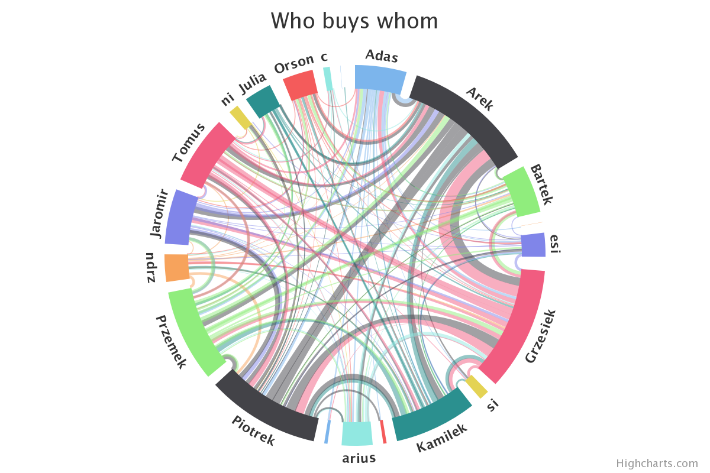

# FairTaskAssigner
[![Latest changes badge][changelog-badge]][CHANGELOG.md]

It is a simple web server application that allows to track the activities (e.g. coffee servings) within the group of friends. It provides many features of tracking points and queue for next servers.





It works based on google authentication token (uses only login and identity picture!).

# Installation
Install all modules:
```bash
pip install -r requirements.txt
```

Use `db/db_scheme.sql` to create [SQLite]() DB.

Finally, create `run.sh` with the credentials created using [Google API Console](https://console.cloud.google.com/apis/credentials):
```bash
export FN_GOOGLE_CLIENT_ID='YOUR_CLIENT_ID'
export FN_GOOGLE_CLIENT_SECRET='YOUR_CLIENT_SECRET'
export FN_FLASK_SECRET_KEY='whatever_key'
export FN_REDIRECT_URI='REDIRECT_URL_YOU_SPECIFY_IN_GOOGLE'

export FN_DB_TO_USE='db/YOUR_SQLite_PATH'

export FN_INSTANCE_NAME='Some APP name' # if not set 'CoffeeTracker'
export FN_DEBUG=True                    # if not set default False
export FN_LISTEN_HOST_IP='any ip'       # if not set default 127.0.0.1
export FN_HOST_PORT='port'              # if not set default 8040

python app.py
```
To start server `sh run.sh`, it will start server listening at `FN_LISTEN_HOST_IP:FN_HOST_PORT`.
